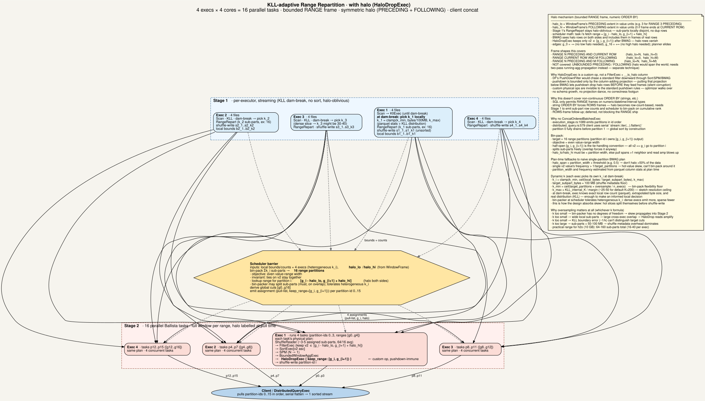

<!---
  Licensed to the Apache Software Foundation (ASF) under one
  or more contributor license agreements.  See the NOTICE file
  distributed with this work for additional information
  regarding copyright ownership.  The ASF licenses this file
  to you under the Apache License, Version 2.0 (the
  "License"); you may not use this file except in compliance
  with the License.  You may obtain a copy of the License at

    http://www.apache.org/licenses/LICENSE-2.0

  Unless required by applicable law or agreed to in writing,
  software distributed under the License is distributed on an
  "AS IS" BASIS, WITHOUT WARRANTIES OR CONDITIONS OF ANY
  KIND, either express or implied.  See the License for the
  specific language governing permissions and limitations
  under the License.
-->

# Distributed RANGE-frame Windows via KLL-adaptive Range Repartition

## Problem

DataFusion's `BoundedWindowAggExec` requires single-partition input. Applied naively to a distributed plan, this
collapses all sorted rows onto one executor before the window runs:

```text
BoundedWindowAggExec
  SortPreservingMergeExec [v2 ASC]
    ExchangeExec partitioning=None
      SortExec [v2 ASC], preserve_partitioning=true
        DataSourceExec file_groups={8 groups: ...}
```

At h2o scale (10 GB, `RANGE 3 PRECEDING`) this OOMs on a single-executor cluster and stragglers a multi-executor
one. Both the sort and the window run serially on a single node.

## Approach

Two stages plus the standard Ballista client-side concat. Stage 1 streams a KLL sketch over each executor's data,
splits into locally-disjoint sub-partitions, and shuffle-writes. A scheduler barrier bin-packs those sub-partitions
into global range-disjoint output partitions. Stage 2 runs the full end-to-end window pipeline in parallel,
one Ballista task per output partition. Because a Ballista task is single-partition by construction, DataFusion's
`BoundedWindowAggExec` constraint is satisfied naturally.



## Stage-by-stage

### Stage 1 · Scan, KLL, RangeRepart, shuffle-write

Each executor streams its file groups through a `KllExec` that accumulates a value-distribution sketch until the
"dam breaks" — enough samples for reliable local quantile boundaries. At dam-break the executor picks its own `k`
locally:

```text
k_i = clamp(k_min, ceil(local_bytes / target_subpart_bytes), k_max)
```

where `k_min = ceil(target_partitions * oversample / n_execs)` is the bin-pack flexibility floor (oversample ∈ [4, 10]),
`k_max` is bounded by the KLL sketch's internal resolution (~25-50 for default KLL K=200), and
`target_subpart_bytes` ≈ 100 MB is the shuffle-metadata floor.

Sub-partitions land unsorted on disk. Stage 1 stays streaming — no blocking sort.

### Scheduler barrier · bin-pack

The scheduler collects `(local bounds, row counts)` from all executors and bin-packs the Σk_i sub-partitions into
16 global range-disjoint partitions (one per Stage-2 core). Bin-pack rules:

- **Objective**: even value-range width across output partitions.
- **Half-open convention**: partition i owns `[g_i, g_{i+1})`. All rows with `v2 == g_i` go to partition i.
  This is the tie-handling mechanism — ties never split across partitions.
- **Sub-part splits**: bin-packer freely splits sub-partitions, and must, on cross-executor range overlap.
- **Heterogeneous k**: dense-slice executors emit more sub-parts than sparse-slice ones. Bin-packer tolerates.
- **Halo extension**: for a `WindowFrame` with `N PRECEDING` and `M FOLLOWING`, partition i's fetch range is
  `[g_i - N, g_{i+1} + M]`.

Emits per-partition assignments `(pull_list, keep_range=[g_i, g_{i+1}))` back to Stage 2 tasks.

### Stage 2 · full window per range, halo-labelled at pull time

Each of the 16 tasks runs:

```text
ShuffleReader (assigned sub-parts)
  → FilterExec (keep v2 ∈ [g_i - halo_lo, g_{i+1} + halo_hi])
  → SortExec[v2 asc]
  → SortPreservingMerge (N → 1)
  → BoundedWindowAggExec
  → HaloDropExec { keep_range: [g_i, g_{i+1}) }
  → shuffle-write partition-id i
```

BWAG sees halo rows and includes them in frames of real rows; correct by construction. `HaloDropExec` runs after
BWAG and keeps only rows in `[g_i, g_{i+1})`.

`HaloDropExec` is a custom physical operator, not a `FilterExec + __is_halo` column, because DataFusion's
`PushDownFilter` would chase a standard filter downward through Sort/SPM/BWAG. Pushdown is bounded only by a
column-adding projection; placing that projection below BWAG lets pushdown drop halo rows *before* they feed frames
(silent corruption). Custom physical operators are invisible to standard pushdown rules — the optimizer walks over
them.

### Client · concat is free

The 16 range-disjoint output partitions concatenate to a globally-sorted stream. No client-side merge, no
`ConcatOrderedBatchesExec` needed — Ballista's existing client-pull already emits partitions in id order:

- `ballista/scheduler/src/state/execution_stage.rs` — `partition_locations()` iterates
  `for i in 0..output_partition_count`, guaranteeing ascending partition-id order.
- `ballista/scheduler/src/state/aqe/mod.rs` — `output_locations = locations.into_iter().flatten().collect()`
  preserves that order into the scheduler's job status.
- `ballista/core/src/execution_plans/distributed_query.rs` — client's `execute_query_pull` maps
  `partition_location.into_iter()` to per-partition fetches and returns `futures::stream::iter(streams).flatten()`.
  That flatten is serial: partition 0 fully drains before partition 1 starts. Concat, by construction.

Flight SQL routes through the same scheduler machinery, so endpoint ordering inherits the same guarantee.

## Frame shapes supported

- `RANGE N PRECEDING AND CURRENT ROW` (`halo_lo=N, halo_hi=0`)
- `RANGE CURRENT ROW AND M FOLLOWING` (`halo_lo=0, halo_hi=M`)
- `RANGE N PRECEDING AND M FOLLOWING` (`halo_lo=N, halo_hi=M`)

Not covered: `UNBOUNDED PRECEDING` or `UNBOUNDED FOLLOWING` — halo would span the world. A separate two-pass
running-aggregate propagation technique is needed there, out of scope for this design.

Also not covered: non-numeric `ORDER BY`. SQL only permits `RANGE` frames on numeric/datetime/interval types.
String `ORDER BY` forces `ROWS` frames, which need rank-based halo (Stage 1 emits sub-part row counts, scheduler
bin-packs on cumulative rank). ROWS-frame follow-up, deferred.

## Plan-time fallbacks

Fall back to the naive single-partition BWAG plan when:

- `halo_lo + halo_hi > partition_width × threshold` (e.g. 0.5) — refusing to halo more than 50% of the data.
- Any single `v2` value's frequency `> 1 / target_partitions` — hot-value skew; that value's partition would be
  larger than average no matter how the bin-packer distributes the rest.

Both checks use parquet column stats (min/max, distinct count) available at plan time.

## Considered alternatives

### Sort in Stage 1 instead of Stage 2

Legitimate fork in the road. Trades:

- **Pro**: exact local quantiles (index into sorted array, no KLL approximation); sorted sub-parts on disk mean
  Stage 2 uses SPM only, no per-task sort; if exec-local distributions are similar, local exact-quantile cuts
  converge on global cuts and sub-parts are near-globally-disjoint.
- **Con**: blocking sort in Stage 1 kills streaming; more work concentrated on 4 execs' big sorts vs 16 tasks'
  small sorts; sort memory pressure on Stage 1.

Rejected for the streaming property and load distribution. Worth revisiting if the KLL approximation error at cuts
proves problematic in production.

### Sample-first stage via parquet metadata

Read parquet footer stats (min/max per row group) at plan time in the scheduler, seed approximate global boundaries
before Stage 1 starts, and have Stage 1's KLL refine locally around those seeds. Gives near-globally-disjoint
sub-partitions without any additional execution-time stage.

Rejected as unnecessary complexity for a first cut. The pure-KLL approach converges to similar boundaries whenever
exec-local distributions are similar (typical for randomly-assigned file groups). Revisit if measured read
amplification is painful.

### `FilterExec + __is_halo` column instead of `HaloDropExec`

Reuses standard DataFusion plumbing. Rejected on correctness grounds — see the `HaloDropExec` rationale in Stage 2
above.

### Separate Stage 3 for SPM + BWAG

Would satisfy DataFusion's single-partition BWAG constraint by putting SPM+BWAG on one node. Rejected because a
Ballista task is single-partition by construction — the constraint is already satisfied inside each Stage 2 task,
and an extra stage would add a barrier without benefit.

## Known limitations

- Straggler policy is unspecified. One slow Stage 1 executor blocks the barrier. Standard shuffle problem;
  speculative execution or barrier timeouts would be a separate improvement.
- Bin-pack complexity is `O(sub-parts × partitions)`. For typical sizes (64 × 16 = 1024) trivial.
- Fault tolerance: Stage 2 task failure re-pulls from Stage 1's shuffle store (data on disk). Scheduler failure
  during barrier is handled by Ballista's existing replan mechanism.
